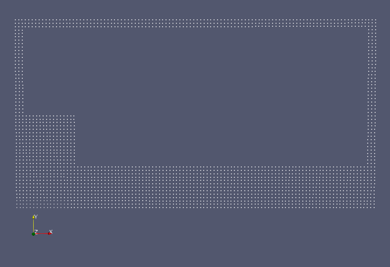
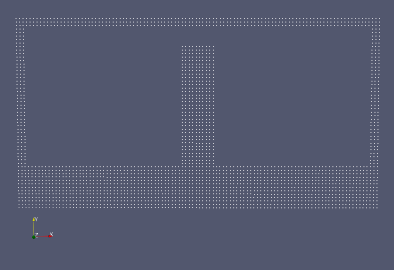
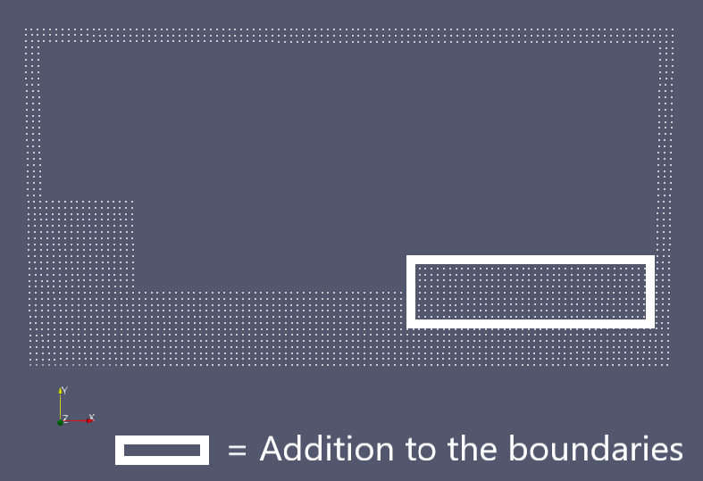
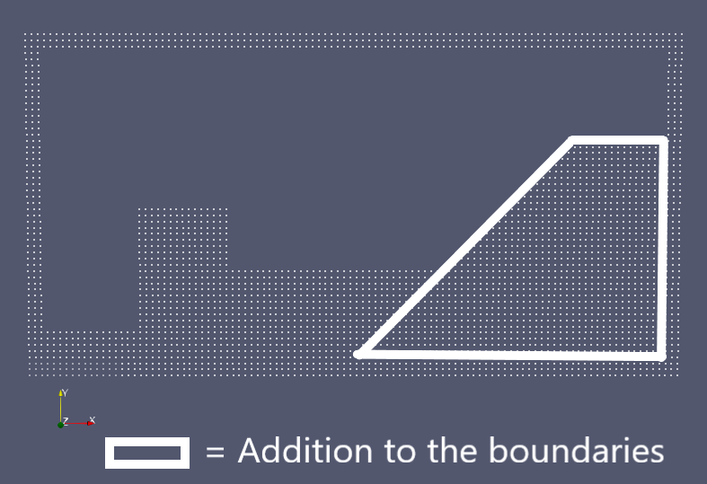
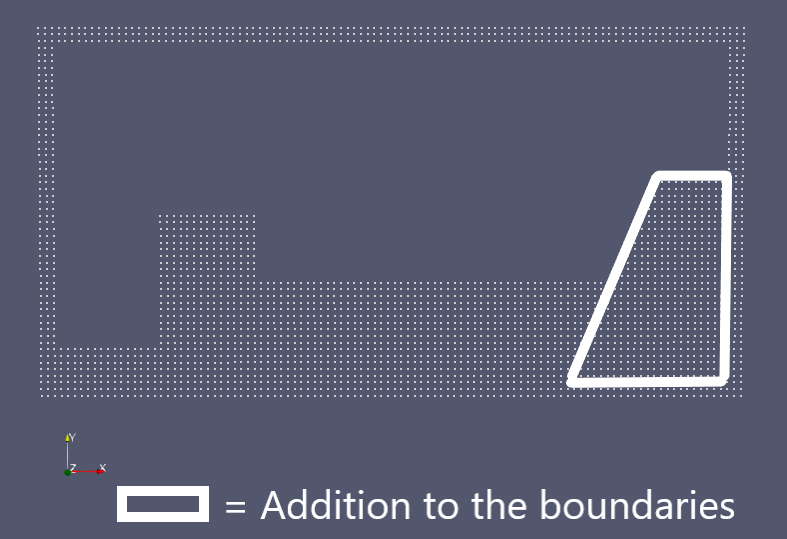
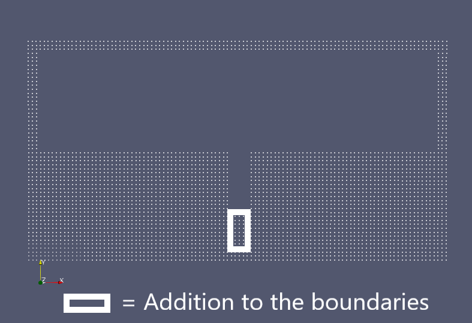

Group Project 3: Smoothed Particle Hydrodynamics (SPH) Simulation (by Team Doon)
=================================================================================

.. contents::

Synopsis
---------

A Smoothed Particle Hydrodynamics (SPH) is a meshless method for solving the Navier-Stokes equation, in which fluid properties are stored on Lagrangian fluid particles (i.e. on particles which move with the fluid flow). The particles interact to generate values across the entire fluid domain through continuous smoothing kernels.

As the SPH method is meshless and Lagrangian, it is ideal for solving problems involving fluid flow with interfaces and free surfaces. This tool implements the SPH method in C++ to solve wave generation in a lock-release/dam-break problem.

In this project, we simulate fluid in a 2D rectangular 'box' domain using this method.

Problem definition
--------------------

Equations
~~~~~~~~~

The fluid particles are simulated using the Navier-Stokes equations:

.. math::
   :nowrap:

   \begin{aligned} 
   \frac{D\pmb{v}}{Dt} & = -\frac{\nabla P}{\rho} + \frac{\mu}{\rho} \nabla^2\pmb{v} + \pmb{g} \\
   \frac{D\pmb{v}}{Dt} & = -\rho\nabla\cdot\pmb{v}
   \end{aligned}


The SPH method allows us to approximate this by modelling individual points which follow the fluid.
For this project we are using a cubic spline as a smoothing kernel, where the cubic spline is defined as

.. math::
  :nowrap:

  \begin{aligned}
   W(\pmb{r}, h) = \frac{10}{7\pi h^2}
   \begin{cases}
     1 - \frac{3}{2}q^2 + \frac{3}{4}q^3,   & 0 \leq q \leq 1\\
     \frac{1}{4}(2-q)^3, & 1 \leq q \leq 2 \\
     0, & q > 2
     \end{cases}
   \end{aligned}

where 

:math:`q = \frac{|\pmb{r}|}{h}`.

Thus we have the approximations for the Navier-Stokes equations:

.. math::
  :nowrap:

  \begin{aligned}
    \frac{\partial\pmb{v}_i}{\partial t} \approx \pmb{a}_i &= -\sum^N_{j=1} m_j\left(\frac{P_i}{\rho_i^2} + \frac{P_j}{\rho_j^2}\right) \frac{dW}{dr}(|\pmb{r}_{ij}|, h)\pmb{e}_{ij} \\
    \frac{\partial\rho_i}{\partial t} \approx D_i &= \sum^N_{j=1} m_j \frac{dW}{dr}(|\pmb{r}_{ij}|, h) \pmb[v]_{ij} \cdot \pmb{e}_{ij}
  \end{aligned}

To close the system, we use the Tait equation to relate pressure to density as follows.

.. math:: 
    P = \frac{\rho_0c_0^2}{\gamma} \left(\left(\frac{\rho}{\rho_0}\right)^\gamma - 1 \right)


Time-stepping method
~~~~~~~~~~~~~~~~~~~~
Once the approximations have been calculated, we step forward in time using one of two time-stepping methods: the Forward Euler scheme, which is first-order accurate, and the Predictor-Corrector scheme, which is second-order accurate but has more complexity.

The Forward Euler scheme is implemented by calculating the following for each particle:

.. math::
  :nowrap:

  \begin{aligned}
    \pmb{x}_i^{t+1} &= \pmb{x}_i^t + \Delta t\ \pmb{v}_i^t \\
    \pmb{v}_i^{t+1} &= \pmb{v}_i^t + \Delta t\ \pmb{a}_i^t \\
    \rho_i^{t+1} &= \rho_i^t + \Delta t\ D_t^t
  \end{aligned}

On the other hand, the Predictor-Corrector takes a half-step:

.. math::
  :nowrap:

  \begin{aligned}
    \pmb{x}_i^{t+\frac{1}{2}} &= \pmb{x}_i^t + 0.5 \Delta t\ \pmb{v}_i^t \\
    \pmb{v}_i^{t+\frac{1}{2}} &= \pmb{v}_i^t + 0.5 \Delta t\ \pmb{a}_i^t \\
    \rho_i^{t+\frac{1}{2}} &= \rho_i^t + 0.5 \Delta t\ D_t^t
  \end{aligned}

then approximates :math:`v`, :math:`a`, :math:`D` at the half-step. Next, it does the full-step as follows

.. math::
  :nowrap:

  \begin{aligned}
    \pmb{x}_i^{t+1} &= \pmb{x}_i^t + \Delta t\ \pmb{v}_i^{t+\frac{1}{2}} \\
    \pmb{v}_i^{t+\frac{1}{2}} &= \pmb{v}_i^t + \Delta t\ \pmb{a}_i^{t+\frac{1}{2}} \\
    \rho_i^{t+\frac{1}{2}} &= \rho_i^t + \Delta t\ D_t^{t+\frac{1}{2}}
  \end{aligned}


Boundaries
~~~~~~~~~~
The simulation occurs in a rectangular 'box' domain of width 20m and height 10m. For the boundaries, we have a layer of particles of width :math: `2h` with fixed position and a fixed velocity of zero. Only the pressure and density of these particles are allowed to change.

To ensure there are no leaks, any particles that reach the boundary are bounced back and its acceleration values are updated to reflect what it should be.

It is possible to create obstacles within the domain i.e. setting fixed particles in various shapes.

Running the Simulation
----------------------

Initial values
~~~~~~~~~~~~~~~
The user can specify the user can set the values of the initial particle spacing :math:`\Delta x`, the speed of sound :math:`c_0`, the initial density :math:`\rho_0`, the factor :math:`h_{fac}` for the smoothing length :math:`h`, and the time step :math:`\Delta t`.  
However, some of these values have conditions placed upon them for the simulation to run properly.

The time-step must fulfill the following conditions:

.. math:: \Delta t = C_{CFL} \ min\{\Delta t_{CFL}, \Delta t_F, \Delta t_A\}

where

.. math::
  \Delta t_{CFL} &= min\left\{\frac{h}{|\pmb{v}_{ij}|}\right\} \\

  \Delta t_{F} &= min\left\{\sqrt{\frac{h}{|\pmb{a}_i|}}\right\} \\

  \Delta t_{A} &= min\left\{\frac{h}{c_0\sqrt{(\rho/\rho_0)^{\gamma-1}}}\right\} 

The default fixed timestep for this simulation is 

.. math:: \Delta t = 0.1 \frac{h}{c_0}

with :math:`c_0=20\ m/s`.

The characteristic smoothing length :math:`h` is found with

.. math::`h = h_{fac} \ \Delta x`

with a default value of :math:`h_{fac}=1.3`.

Initial configuration
~~~~~~~~~~~~~~~~~~~~~
The **default initial configuration** has a water level fixed at a height of 2m, and an initial wave on the left-hand boundary of height 5m (as shown in the image below).



The first variation, ``conf1``, of the initial configuration places a wave of height 9m in the centre of the domain.



The next configuration, ``conf2``, starts with the same wave as in the default configuration, but adds a rectangular obstacle suspended on the right boundary.



The third configuration, ``conf3``, simulates a sloping shoreline on the right boundary and a wave as pictured below.



The fourth configuration, ``conf4``, is similar to the previous one, but simulates an even steeper shoreline.



The final configuration, ``conf5``, simulates the water level fixed at 5m, with a hole of depth 3m in the centre of the domain as follows.




Output and Analysis
--------------------

Post-processing
~~~~~~~~~~~~~~~~

The simulation will output a file every 32 iterations into the and print out the time stamp at the same time. The output can be viewed on apps such as Paraview.

Alternatively, running the Jupyter Notebook ``ACSE-4.3-htmlview.ipynb`` will animate and analyse the output.

Note that all of the outputs listed for each function below are in order.

The function ``read_address`` takes in a string of the file name to read and split the file into its data components. The output is:

* ``length``: the number of points in the data.
* ``dim``: the number of components/axes.
* ``Pre_list``: the pressure of each particle.
* ``V_list``: the velocity of each particle, with a separate sub-list for each velocity component. Note that that as we are simulating in 2D, there are two sub-lists representing :math:`v_x` and :math:`v_y`.
* ``Point_list``: the coordinates of each particle, with a separate sub-list for each position component. Note that that as we are simulating in 2D, there are two sub-lists representing :math:`x`- and :math:`y`- coordinates.

The function ``make_grid`` takes in the ``Point_list`` from ``read_address`` and makes a grid based on the position coordinates. The output is:

* ``step``: the spacing of the grid i.e. :math:`dx`.
* ``y_range``: the range of :math:`y`.
* ``y_grid_size``: the size of the grid to be created on the y-axis i.e. :math:`(max(y) - min(y))/dx`.
* ``x_range``: the range of :math:`x`.
* ``x_grid_size``: the size of the grid to be created on the y-axis i.e. :math:`(max(x) - min(x))/dx`.
* ``y_coord_grid``: the indices of the :math:`y`-values on each gridpoint.
* ``x_coord_grid``: the indices of the :math:`x`-values on each gridpoint.
* ``Vx_grid``: an initialised array of the velocity grid on the :math:`x`-axis. Note that this array is still empty.
* ``Vy_grid``: an initialised array of the velocity grid on the :math:`y`-axis. Note that this array is still empty.
* ``Pre_grid``: an initialised array of the pressure grid. Note that this array is still empty.

The function ``fill_grid`` takes in ``y_coord_grid``, ``x_coord_grid```, ``Vx_grid``, ``Vy_grid``` and ``Pre_grid`` from ``make_grid``, as well as ``V_list``, ``Pre_list``, and ``length`` from ``read_address``. This function fills the grid with the corresponding values of each component.
Thus its output is 

* ``Vx_grid``: the array of the velocity grid on the :math:`x`-axis, now filled with values from the output files.
* ``Vy_grid``: an initialised array of the velocity grid on the :math:`y`-axis, now filled with values from the output files.
* ``Pre_grid``: an initialised array of the pressure grid, now filled with values from the output files.

The function ``find_peak`` retrieves the properties at the peak of the wave. It takes in the output lists from ``read_address``, as well as ``min_y`` which is the minimum height (in metres) where the peak could occur. This is usually set as the initial lowest fluid level, and the default is set at 2m. Finally, an optional input is ``tol``, which is a tolerance value to decide if a particle is considered to be outside of the main body of water e.g. splashing.
The output of this function is 

* ``k``: the maximum height i.e. the peak/crest of the wave.
* ``peak_x_coord``: the corresponding :math:`x`-coordinate at the peak.
* ``Vy_max``: the corresponding :math:`v_y` value at the peak.
* ``Vx_max``: the corresponding :math:`v_x` value at the peak.
* ``Pre_max``: the corresponding pressure value at the peak.
* ``peak_index``: the index of the peak value in the lists.

The function ``ensemble`` combines all the functions above to allow the user to run them all at once. It takes in ``no``, which is the file number to read, and ``tol``, which is the same input as in ``find_peak``. 
The function will then output:

* ``Pre_grid``, ``Vx_grid``, ``Vy_grid`` from ``fill_grid``.
* ``x_coord_grid``, ``y_coord_grid`` from ``make_grid``.
* All of the outputs of ``find_peak``.
* ``step`` from makegrid.

Viewing and analysing the simulation
~~~~~~~~~~~~~~~~~~~~~~~~~~~~~~~~~~~~~

Once the necessary functions have been executed, the rest of the notebook will plot and animate the wave. Simply run the rest of the notebook to see:

* Plots describing the wave peak: the peak height against time, the peak velocities against time, and the peak pressure against time.
* Animation of the wave with a the peak particle at every step highlighted.
* Plot of the time interval between each sloshing (when the wave hits a boundary) as well as a comparison between the theoretical and experimental results of it.
* Animation of the wave showing the distribution of :math:`v_x`, :math:`v_y`, and pressure.

Convergence Analysis
~~~~~~~~~~~~~~~~~~~~~~
A convergence analysis of the simulation can be found in ``Convergence_analysis.ipynb``. It contains

* Comparisons between centres of mass as the resolution changes and as the number of elements in the domain changes (with a fixed resolution).
* Comparisons between the different variables related to the peaks when the resolution changes.

Each of these comparisons does a separate analysis on the position, velocity, acceleration, density, and :math:`\frac{\partial\rho}{\partial t}`. 


